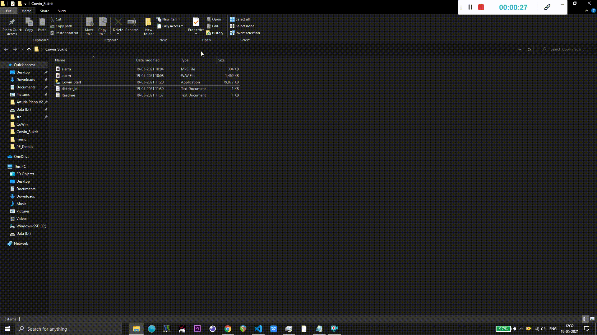

# CoWin-Vaccine-Slot-Checker-Live  🔥




### What it does ?
* This Python script runs every 2 minutes and checks all the vaccine slots for next 10 days that are available on the CoWin website. 
* Whenever a slot is available you will hear a beep , keep the Cowin Portal open so that you can book asap . 


### How does it work or Instructions to use ?

You can ***download*** the folder which has the exe and files under the about section and follow the readme in the folder or you can clone it and run in your machine.

1. ✔️ Clone the repository 
2. ✔️ Run ```pip install ```
3. ✔️ Enter your **district Id** numeric in the district_id.txt in intergers wihout **comma** 
4. ✔️ Run the script using ```python Cowin_Start.py```


#### Features I am working on :
* Sending push Notifications
* Refractoring the Code 
* Feel free to report any issue or collaborate
